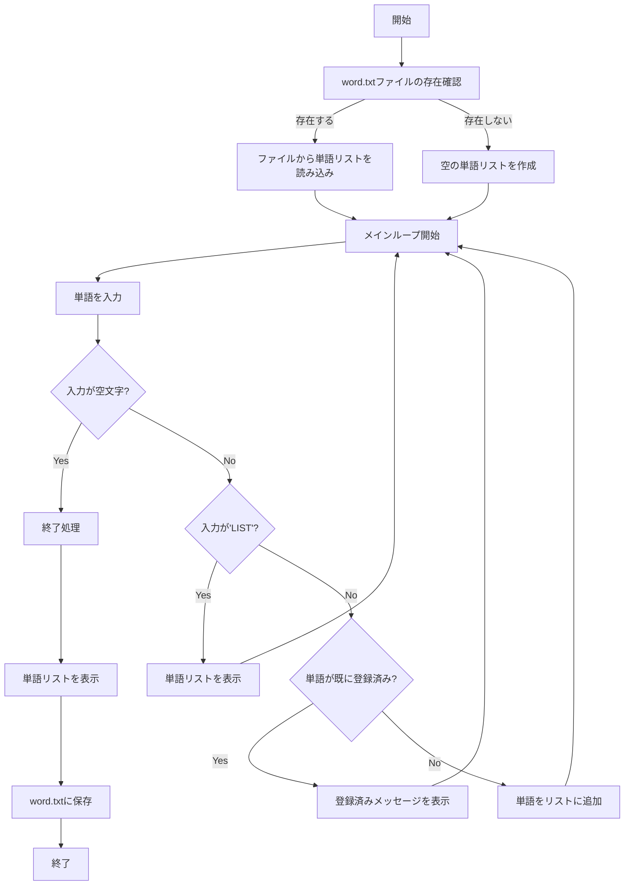

```mermaid
flowchart TD
    A[開始] --> B[word.txtファイルの存在確認]
    B -->|存在する| C[ファイルから単語リストを読み込み]
    B -->|存在しない| D[空の単語リストを作成]
    C --> E[メインループ開始]
    D --> E
    
    E --> F[単語を入力]
    F --> G{入力が空文字?}
    G -->|Yes| H[終了処理]
    G -->|No| I{入力が'LIST'?}
    
    I -->|Yes| J[単語リストを表示]
    I -->|No| K{単語が既に登録済み?}
    
    J --> E
    K -->|Yes| L[登録済みメッセージを表示]
    K -->|No| M[単語をリストに追加]
    
    L --> E
    M --> E
    
    H --> N[単語リストを表示]
    N --> O[word.txtに保存]
    O --> P[終了]
```
