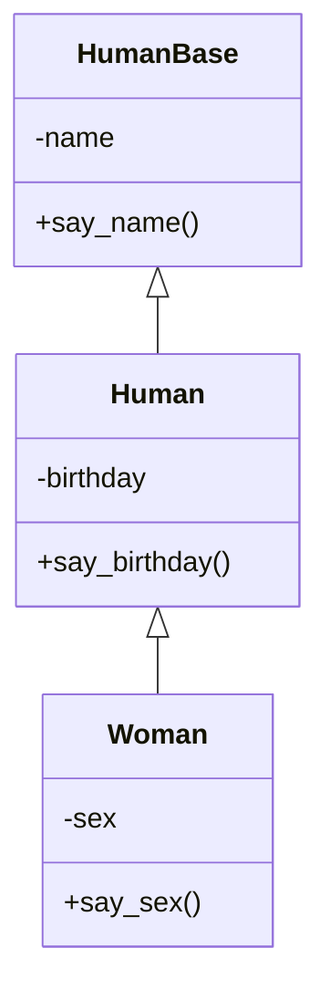

```mermaid
classDiagram
	class HumanBase {
        -name
        +say_name()
    }
    class Human {
        -birthday
        +say_birthday()
    }
    HumanBase <|-- Human
    Human <|-- Woman
    class Woman {
        -sex
        +say_sex()
    }
```
