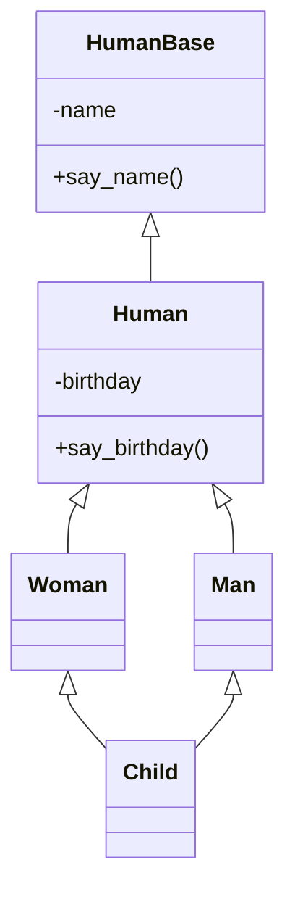

# 14 Python基礎

## 継承

- P.109 継承〜P.113 残り物あれこれ までをよく読んでください


### 簡単な継承の例

- まずクラスの使用方法を確認しておいてください

【class1.py】

```python
class TestClass:
    pass


obj1 = TestClass()

print(type(obj1))       # 型を出力
print(dir(obj1))        # 全ての変数・メソッド等を出力
print(obj1.__dict__)    # 属性と値を出力
```

- 何が出力されるのか確認してください


【class2.py】

```python
class SampleClass:
    def __init__(self, value) -> None:
        self.value = value

    def print_value(self) -> None:
        print(f'value : {self.value}')


obj2 = SampleClass(100)

print(type(obj2))
print(dir(obj2))
print(obj2.__dict__)

print('-'*10)
print(obj2.value)
v = getattr(obj2, 'value')
print(v)

print('-'*10)
obj2.print_value()
f0 = obj2.print_value
f0()

f1 = getattr(obj2, 'print_value')
f1()

f2 = getattr(obj2, 'print_value')()
f2
```

> https://cpp-learning.com/getattr/	参照

- 以下の関数の使い方を理解してください
- `getattr()` 
- `setattr()`
- `hasattr()`
- `delattr()`


### 継承の定義

- 継承するには以下のように記述する

```python
class 継承したクラス名(継承元クラス名):
    処理内容
```


- 順に属性を増やしていく例を確認してみよう

【inheritance1.py】

- 元となるクラス HumanBase

```python
class HumanBase:
    def __init__(self, name) -> None:
        self.name = name

    def say_name(self) -> None:
        print(f'私の名前は「{self.name}」です')


# main
h1 = HumanBase('吉村')
h2 = HumanBase('佐藤')

h1.say_name()
h2.say_name()
```


【inheritance2.py】

- HumanBaseを継承し、Humanクラスを作成

```python
class HumanBase:
    def __init__(self, name) -> None:
        self.name = name

    def say_name(self) -> None:
        print(f'私の名前は「{self.name}」です')


class Human(HumanBase):
    def __init__(self, name, birthday) -> None:
        super().__init__(name)
        self.birthday = birthday

    def say_birthday(self) -> None:
        print(f'誕生日は{self.birthday}です')


# main
h1 = Human('吉村', '2000-01-01')
h2 = Human('佐藤', '2010-12-31')

h1.say_name()
h1.say_birthday()
h2.say_name()
h2.say_birthday()
```


【inheritance3.py】

- Humanクラスを継承し、ManとWomanを作成

```python
class HumanBase:
    def __init__(self, name) -> None:
        self.name = name

    def say_name(self) -> None:
        print(f'私の名前は「{self.name}」です')


class Human(HumanBase):
    def __init__(self, name, birthday) -> None:
        super().__init__(name)
        self.birthday = birthday

    def say_birthday(self) -> None:
        print(f'誕生日は{self.birthday}です')


class Woman(Human):
    def __init__(self, name, birthday) -> None:
        super().__init__(name, birthday)
        self.sex = '女'

    def say_sex(self):
        print(f'性別は{self.sex}性です')


class Man(Human):
    def __init__(self, name, birthday) -> None:
        super().__init__(name, birthday)
        self.sex = '男'

    def say_sex(self):
        print(f'性別は{self.sex}性です')


# main
h1 = Woman('吉村', '2000-01-01')
h2 = Man('佐藤', '2010-12-31')

h1.say_name()
h1.say_birthday()
h1.say_sex()
h2.say_name()
h2.say_birthday()
h2.say_sex()
```

- この例の場合、`Man`,`Woman`にそれぞれ`say_sex()`を持っているが、super.classに`say_sex()`に作成した方が良い。


【inheritance3_2.py】

- super.classに`say_sex()`を作成した例

```python
class HumanBase:
    def __init__(self, name) -> None:
        self.name = name

    def say_name(self) -> None:
        print(f'私の名前は「{self.name}」です')


class Human(HumanBase):
    def __init__(self, name, birthday) -> None:
        super().__init__(name)
        self.birthday = birthday

    def say_birthday(self) -> None:
        print(f'誕生日は{self.birthday}です')
        
    def say_sex(self):
        print(f'性別は{self.sex}性です')


class Woman(Human):
    def __init__(self, name, birthday) -> None:
        super().__init__(name, birthday)
        self.sex = '女'

class Man(Human):
    def __init__(self, name, birthday) -> None:
        super().__init__(name, birthday)
        self.sex = '男'


# main
h1 = Woman('吉村', '2000-01-01')
h2 = Man('佐藤', '2010-12-31')

h1.say_name()
h1.say_birthday()
h1.say_sex()
h2.say_name()
h2.say_birthday()
h2.say_sex()
```


【inheritance3_3.py】

- さらに修正した例
  - class Man / class Woman / class Human を変更

```python
class HumanBase:
    def __init__(self, name) -> None:
        self.name = name

    def say_name(self) -> None:
        print(f'私の名前は「{self.name}」です')


class Human(HumanBase):
    def __init__(self, name, birthday, sex) -> None:
        super().__init__(name)
        self.birthday = birthday
        self.sex = sex

    def say_birthday(self) -> None:
        print(f'誕生日は{self.birthday}です')
        
    def say_sex(self):
        print(f'性別は{self.sex}性です')


class Woman(Human):
    def __init__(self, name, birthday) -> None:
        super().__init__(name, birthday, '女')


class Man(Human):
    def __init__(self, name, birthday) -> None:
        super().__init__(name, birthday, '男')


# main
h1 = Woman('吉村', '2000-01-01')
h2 = Man('佐藤', '2010-12-31')

h1.say_name()
h1.say_birthday()
h1.say_sex()
h2.say_name()
h2.say_birthday()
h2.say_sex()

```


【inheritance4.py】

- `setattr()`を使用して、オブジェクトに関数を追加した場合

```python
class HumanBase:
    def __init__(self, name) -> None:
        self.name = name

    def say_name(self) -> None:
        print(f'私の名前は「{self.name}」です')


class Human(HumanBase):
    def __init__(self, name, birthday) -> None:
        super().__init__(name)
        self.birthday = birthday

    def say_birthday(self) -> None:
        print(f'誕生日は{self.birthday}です')


class Woman(Human):
    def __init__(self, name, birthday) -> None:
        super().__init__(name, birthday)
        self.sex = '女'


class Man(Human):
    def __init__(self, name, birthday) -> None:
        super().__init__(name, birthday)
        self.sex = '男'


# main
h1 = Woman('吉村', '2000-01-01')
h2 = Man('佐藤', '2010-12-31')


def func():
    print('性別は女です')

# インスタンスh1に関数say_sexを追加
setattr(h1, 'say_sex', func)

h1.say_name()
h1.say_birthday()
h1.say_sex()        # h1は問題なく動作
h2.say_name()
h2.say_birthday()
h2.say_sex()        # h2には関数がないのでError
```


### 多重継承

- 複数の基底クラスを持つ継承



- 上記のように、複数のクラスから継承を行うことが可能。
  - ただし、設計をしっかり行わないと、コードが煩雑になり余計に手間がかかることになる。


- クラス図の書き方

  > https://cacoo.com/ja/blog/how-to-write-class-diagram/

- Markdownでのクラス図の描画

  - mermaidを使用することが多い

    > https://mermaid.js.org/syntax/classDiagram.html

- マーメイドでクラス図

  > https://qiita.com/hirokiwa/items/1a490c75961efd1e1487


#### vscode拡張

- markdownが好きではない・慣れていない場合、GUIツールを利用するのも良いかも


- 拡張子、`.drawio`,`dio`などでファイルを作成すると利用可能になる。


### 練習1

1. 動物の基本クラスを定義し、それを継承する具体的な動物クラスを作成してください。(ren1_1.py)

- `Animal`という名前の基本クラスを定義してください。
  - `Animal`クラスは、名前を属性として持ち、`speak`というメソッドを持ちます。
    `speak`メソッドは空で構いません。
    `get_name`メソッドは、名前を返す（取り出す）とします。

- `Dog`と`Cat`という名前のクラスを`Animal`クラスを継承して定義してください。
  - それぞれの動物の鳴き声を表示するように`speak`メソッドを実装してください。

- 各クラスのインスタンスを作成し、`speak`メソッドを呼び出してください。

【実行結果】

```
スヌーピー:ワンワン！
たま:ニャー
```

【ren1_1.py】

```python
class Animal:
        pass

# main
dog = Dog("スヌーピー")
cat = Cat("たま")

print(f'{dog.get_name()}:', end='')
dog.speak()
print(f'{cat.get_name()}:', end='')
cat.speak()
```


2. 動物園の動物クラスを作成し、親クラスのメソッドを呼び出して下さい。(ren1_2.py)

- `Animal`という基本クラスを定義してください。
  - `species`という属性と`make_sound`というメソッドを持ちます。

- `Lion`というクラスを`Animal`クラスを継承して定義してください。
  - `make_sound`メソッドをオーバーライドしてライオンの鳴き声を表示するようにしてください。

- `make_sound`メソッドを呼び出す際に、スーパークラスのメソッドも呼び出して一般的な動物の音を表示するようにしてください。

【実行結果】

```
ガサゴソッ
ガオォーー！
```

【ren1_2.py】

```python
class Animal:
	pass

# main
lion = Lion("Lion")
lion.make_sound()
```


3. 車の基本クラスを定義し、特定のタイプの車クラスを継承します。(ren1_3.py)

- `Car`という名前の基本クラスを定義してください。
  - このクラスは、`maker`と`model`という属性を持ちます。
- `ElectricCar`というクラスを`Car`クラスを継承して定義してください。
  - このクラスは、`battery_size`という追加の属性を持ちます。
  - `describe`というメソッドをオーバーライドして電気自動車の詳細を表示するようにしてください。
- `ElectricCar`クラスのインスタンスを作成し、`describe`メソッドを呼び出してください。

【実行結果】

```
電気自動車: Tesla - Model S (バッテリー容量：100-kWh)
```

【ren1_3.py】

```python
class Car:
	pass

# main
tesla = ElectricCar("Tesla", "Model S", 100)
tesla.describe()
```


4. 多重継承を使用して特定のクラスを作成し、それぞれのスーパークラスのメソッドを呼び出します。(ren1_4.py)

- `Flyable`というクラスを定義し、`fly`というメソッドを持ちます。
- `Swimmable`というクラスを定義し、`swim`というメソッドを持ちます。
- `FlyingFish`というクラスを定義し、`Flyable`と`Swimmable`を継承します。
  - このクラスでは、`fly`と`swim`の両方のメソッドを呼び出す`perform_actions`というメソッドを定義してください。

【実行結果】

```
空を飛べる！
水中を泳げる！
```

【ren1_4.py】

```python
class Flyable:
	pass

# main
fish = FlyingFish()
fish.perform_actions()
```


## 反復子（イテレータ）

- イテレータは自作することができる
  - `__next__()`を作成することで、自由に制御可能
- 実際に作成しながら、試してみよう。


### 練習2

1. 基本的なカウンタのイテレータを作成します。(ren2_1.py)

- `Counter`という名前のクラスを定義してください。
  - `__init__`メソッドで`start`値を受け取り、`__iter__`メソッドと`__next__`メソッドを実装します。
  - `__next__`メソッドは、現在の値を返し、カウンタを1ずつ増やします。
- カウンタのインスタンスを作成し、`for`ループを使用して最初の5つの値を出力してください。

【実行結果】

```
0
1
2
3
4
```

【ren2_1.py】

```python
class Counter:
    def __init__(self, start):
        self.current = start

    def __iter__(self):
        return self

    def __next__(self):
		pass


# main
counter = Counter(0)
for _ in range(5):
    print(next(counter))
```


2. 特定の範囲内の数を返すイテレータを作成します。(ren2_2.py)

- `RangeIterator`という名前のクラスを定義してください。
  - `__init__`メソッドで`start`と`end`値を受け取り、`__iter__`メソッドと`__next__`メソッドを実装します。
  - `__next__`メソッドは、現在の値を返し、カウンタを1ずつ増やしますが、`end`値に達したら`StopIteration`を発生させます。
- このイテレータを使用して、指定された範囲の数を出力してください。

【実行結果】

```
10
11
12
13
14
```

【ren2_2.py】

```python
class RangeIterator:
	pass

# main
range_iter = RangeIterator(10, 15)
for number in range_iter:
    print(number)
```


3. ファイルの各行を順番に返すイテレータを作成します。(ren2_3.py)

- `FileIterator`という名前のクラスを定義してください。
  - このクラスは`__init__`メソッドでファイルのパスを受け取り、`__iter__`メソッドと`__next__`メソッドを実装します。
  - `__next__`メソッドは、ファイルの次の行を返しますが、ファイルの終わりに達したら`StopIteration`を発生させます。
- sample.txtを用意したので、そのファイルの行を順番に出力してください。

【実行結果】

```
1行目
2行目
3行目
4行目
5行目
6行目
```

【ren2_3,py】

```python
class FileIterator:
    def __init__(self, file_path):
        self.file = open(file_path, 'r')
        self.lines = self.file.readlines()
        self.file.close()
        self.index = 0

	pass

# main
file_iter = FileIterator('sample.txt')
for line in file_iter:
    print(line.strip())
```


4. 無限に続く数列を生成するイテレータを作成します。(ren2_4.py)

- `RandomSequence`という名前のクラスを定義してください。

  - `__init__`メソッドで`start`値を受け取り、`__iter__`メソッドと`__next__`メソッドを実装します。
  - `__next__`メソッドは、現在の値を返し、カウンタを毎回乱数を用いて1〜4増やします。

  このイテレータを使用して、最初の10個の値を出力してください。

【実行結果】

```
1
4
9
11
14
17
22
23
26
29
```

【ren2_4.py】

```python
import random


class RandomSequence:
	pass

# main
random_seq = RandomSequence(1)
for _ in range(10):
    print(next(random_seq))
```


## ジェネレータ

- 関数の形で記述し、実行状態を保持した関数のような存在
  - 過去の結果をたくさん保持しないで済むような処理に向く
  - yeildでその時点の値を返す

> https://atmarkit.itmedia.co.jp/ait/articles/1911/19/news015.html
>
> https://nprogram.hatenablog.com/entry/2018/07/21/084537

- 上記の内容をよく読んで理解してください。


【generate_1,py】

```python
def gen_pi4():
    lst = [1, 4, 1, 5]
    for i in lst:
        yield i


# main
for n in gen_pi4():
    print(n)
```

- どのような結果になるか考えてみてください。
  - 考えと実行結果が一致していますか？


【generate_2.py】

- 少し遊んでみた。

```python
def gen_pi4():
    lst = [1, 4, 1, 5]
    for i in lst:
        yield i


def gen_pi6():
    ans = 355/113 - 3
    for _ in range(6):
        yield int(ans * 10)
        ans = ans*10 - int(ans*10)


def gen_pi15():
    ans = 1019514486099146 / 324521540032945 - 3
    for _ in range(15):
        yield int(ans * 10)
        ans = ans*10 - int(ans*10)


def gen_pi1000():
    try:
        with open('pi.txt', 'r') as f:
            lst = f.readline()
        for i in lst:
            yield i
    except FileNotFoundError:
        print("ファイルが見つかりません")
        return
    except Exception as e:
        print(f"エラーが発生しました: {e}")
        return


# main
print("\npi4()")
for n in gen_pi4():
    print(n,end='')

print("\npi6()")
for n in gen_pi6():
    print(n,end='')

print("\npi15()")
for n in gen_pi15():
    print(n,end='')

print("\npi1000()")
for n in gen_pi1000():
    print(n,end='')
```

- 良く読んでみてください。


### 練習3

1. 素数を生成するジェネレータを作成します。(ren3_1.py)

- `prime_generator`という名前のジェネレータ関数を定義してください。
  - この関数は無限に素数を生成します。
- このジェネレータを使用して、最初の20個の素数を出力してください。
- `is_prime()`は、素数であるかどうかをチェックする関数です。このまま使用してください。

【実行結果】

```
2
3
5
7
11
13
17
19
23
29
31
37
41
43
47
53
59
61
67
71
```

【ren3_1.py】

```python
def is_prime(n):
    if n < 2:
        return False
    for i in range(2, int(n ** 0.5) + 1):
        if n % i == 0:
            return False
    return True


def prime_generator():
	pass

# main
pass
```


2. 二つの数列の対応する要素の和を生成するジェネレータを作成します。(ren3_2.py)

- `pair_sum`という名前のジェネレータ関数を定義してください。
  - この関数は二つのイテラブルを受け取り、対応する要素の和を生成します。
- 二つのリストを用意し、このジェネレータを使用して対応する要素の和を出力してください。

【実行結果】

```
11
22
33
44
```

【ren3_2.py】

```python
def pair_sum(iter1, iter2):
	pass

list1 = [1, 2, 3, 4]
list2 = [10, 20, 30, 40]
for sum_val in pair_sum(list1, list2):
    print(sum_val)
```

※ 参考

> https://note.nkmk.me/python-zip-usage-for/

